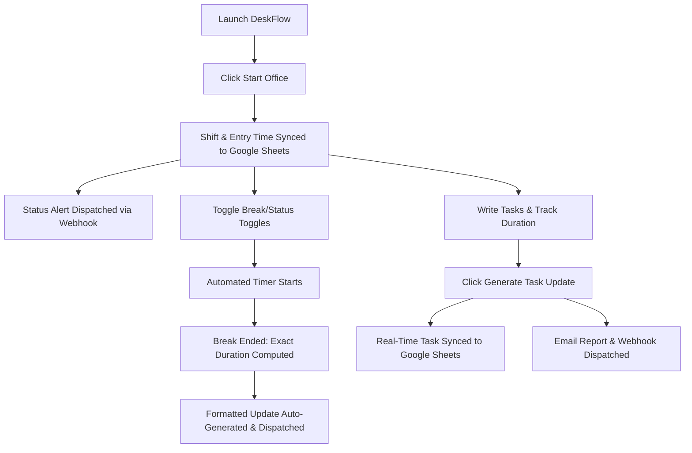

# ⚡ DeskFlow
> **Real-time Work Presence, Time Tracking & Standup Automation**

DeskFlow is an elegant, desktop-native work presence, task tracking, and attendance manager designed for remote, hybrid, and in-office professionals. It eliminates the friction of manual status writing, time calculations, and daily reporting—combining real-time presence toggles, automated task time tracking, 1-click email dispatches, and instant Google Sheets cloud synchronization into a single seamless workspace.


## Download

Download the latest installer from the [Releases](https://github.com/mitul002/DeskFlow-Official/releases/latest) page.


## Installation

1. Download `DeskFlow_Setup.exe` from Releases
2. Run the installer and follow on-screen instructions
3. DeskFlow will launch automatically after installation


---

## 💡 Why DeskFlow?

### 👤 For Employees: Focus More, Type Less
* **Instant Presence Toggles:** Start or end office hours, lunch breaks, or prayer times in a single click. 
* **Zero-Math Time Tracking:** DeskFlow automatically calculates the exact duration of your breaks and working hours down to the minute (e.g., *"back from prayer break at 3:27 pm (16min)"*).
* **Speedy Task Writing & Quick Templates:** Insert preset tags (`Code Review`, `Bug Fixing`, `Listing Design`, `Client Meeting`) to assemble daily standup reports in seconds.
* **Automated Standup Dispatch:** Send formatted daily task summaries directly to management via email and team webhooks without opening a browser or email client.
* **Attendance & Analytics Dashboard:** Track active working hours against daily targets, review monthly calendar logs, and manage off-day schedules.

### 🏢 For Offices & HR: Total Visibility Without Micro-Management
* **Automated Real-Time Task & Attendance Ledger:** Live-syncs employee check-in times, task descriptions, project names, duration spent per task, and break records into a central Google Sheet.
* **Instant Task Duration Insights:** HR and leads can instantly see *who is working on what project*, *when they started*, and *how many hours were spent on each specific task*.
* **Automated Email Reports:** Receive beautifully formatted HTML daily standup summaries automatically when employees complete their shifts.
* **Standardized Team Reports:** Keeps Slack, Teams, and Discord channels clean, structured, and readable.
* **Privacy-First & Secure Tracking:** Promotes trust without invasive monitoring spyware or keyloggers, leaving employees in control while capturing accurate metrics.

---

## 🛠 Feature Tour

### 1. Attendance & Accurate Work Time Accounting
* Displays real-time date and active session clock.
* Tracks **Total Worked Time** and **Total Break Time** dynamically throughout the day against customizable daily targets (e.g., 8.0 hrs).
* Automatically detects *"Good Morning"* and *"Leaving from office"* triggers to start/stop active session timers.
* Built-in **Idle Tracker** to alert employees when system inactivity is detected.

### 2. Automated Real-Time Task & Attendance Tracker (Google Sheets Sync)
* **Live Centralized Cloud Ledger:** Automatically appends or updates employee check-in times, shift logs, and task details in real-time on your team's master Google Sheet.
* **Task-by-Task Duration Tracking:** Logs exact project names, task descriptions, work links (PRs/Figma/Docs), task status (*Completed / In Progress*), and exact time spent per task.
* **Non-Blocking Background Sync:** Syncs data silently in the background without freezing or slowing down the application.

### 3. Daily Task Update Card & 1-Click Automated Email Reports
* **Zero-Typing Automated Email Reports:** DeskFlow automatically compiles all your logged tasks previously synced to Google Sheets into a clean task table, adds your exact daily worked hours and break stats (all software-managed automatically), and sends the complete report to your manager or client with **1 single click**—no manual re-writing required!
* **Smart Quick-Task Templates:** Highly responsive text-entry canvas with a compact, scrollable preset panel (`A+ Content Design`, `Listing Image Design`, `Code Review`, `Bug Fixing`, `Client Meeting`).
* **Dynamic Row Limiter:** Preset button deck scrolls independently (maximum 2 rows) so adding templates won't stretch the window or hide controls.
* **Instant Clipboard & Markdown Previews:** Live preview pane with 1-click **Copy to Clipboard** for quick sharing across Slack, Teams, or Discord.

### 4. Multi-Channel Team Webhook Dispatcher
* **1-Click Broadcast:** Publish presence updates (*Good Morning*, *Lunch Break*, *Prayer Break*, *Leaving Office*) across Slack, Microsoft Teams, and Discord channels simultaneously.
* **Custom Webhook Identities:** Personalize status updates with custom display names, avatar URLs, and status emojis (`None`, `Office`, `Laptop`, `Rocket`, etc.).

### 5. Smart Break Manager
* Dynamic presets for **Lunch** (🍽) and **Prayer** (🕌) with customizable alert limits.
* Built-in **Combo Break** toggle (🍽+🕌 Prayer + Lunch) to combine status alerts in one action.
* **Custom Break Creator:** Add personalized break options (e.g., *"Client Call"*, *"Coffee Break"*) with custom labels and live countdown badges.
* Automatic break timers that track and format exact start and end times dynamically.

### 6. Visual Activity Calendar, Graphs & Analytics
* **Interactive Work Graphs:** Visually rich bar graphs graphing daily worked hours vs. break durations, making productivity trends instantly readable.
* **30-Day Calendar Strip & Grid:** Inspect active office check-ins, completed shifts, and scheduled off-days.
* **Off-Days & Schedule Manager:** Configure weekly off-days (e.g., Sundays) and custom recurring occurrences (e.g., 2nd & 4th Saturdays).

### 7. Seamless Desktop Experience & Autostart
* **Silent System Tray Autostart:** Automatically launches on Windows boot directly into the System Tray (`--autostart`) without cluttering the screen.
* **Minimize-to-Tray Persistence:** Closing ($X$) or minimizing keeps DeskFlow running silently in the background.
* **Streamlined Settings Navigation:** Clean sub-tab layout: Application Settings, Off-Days, Message Templates, Webhooks, Google Sheets, and Email.

### 8. Stealth Security & Licensing Engine
* **Machine-Bound Licensing:** Secure activation tied to the user's workstation.
* **30-Day Automated Trial:** Full access out of the box with offline grace period support.
* **Self-Service Device Shift:** Simple 1-click device transfer request system for hardware upgrades.

---

## ⚙️ How It Works



1. **Session Initializing:** Launching the app and clicking **Start Office** creates an active session. DeskFlow logs the entry time into local storage, syncs the check-in to Google Sheets, and dispatches a webhook status alert.
2. **Break Calculation:** Toggling a break pauses the active work timer, begins a secondary break timer, and logs the start timestamp. Ending the break calculates the delta duration, adds it to the daily break total, and builds a formatted status update containing custom emojis and exact durations.
3. **Task Time Tracking & Cloud Sync:** As employees log tasks, DeskFlow captures the project name, details, work links, status, and duration spent. Clicking **Sync / Generate Task** uploads the record to the central Google Sheet ledger in real time.
4. **Automated Dispatch:** Formatted Markdown and HTML summaries are simultaneously sent via SMTP email dispatches and async HTTP webhooks to Slack, Teams, or Discord.
5. **Data Logging & Visualizing:** All events, sessions, and break logs are stored in a structured local JSON database (`settings.json` and `history.json`), populating the 30-day interactive calendar and analytics graphs.

---

## 💻 Tech Stack
* **UI Framework:** WPF (Windows Presentation Foundation) rendered via XAML for fluid, hardware-accelerated dark UI styling.
* **Execution Engine:** PowerShell Scripting Engine using PresentationFramework and PresentationCore assemblies.
* **Database & Cloud Layer:** Local JSON flat files (`settings.json`, `history.json`) + Google Apps Script REST API integration.
* **Email & Webhook Engine:** Built-in System.Net.Mail SMTP client & async REST HTTP Webhook dispatcher.
* **Compilation Pipeline:** Compiled to a native Windows Executable (`.exe`) using **PS2EXE**.
* **Deployment System:** Custom Inno Setup Unicode script compiling resources, checking for running instances, managing windows registry pathing, and handling local user folder cleanups upon uninstallation.

---

## 📥 Installation Guide

1. Navigate to the `installer` directory in this repository.
2. Locate and double-click the **`DeskFlow_Setup.exe`** wizard.
3. Choose the directory to install the program (default: `{autopf}\DeskFlow`).
4. Select whether to create a desktop shortcut.
5. Click **Install**. The setup process will automatically:
   * Stop any running instances of DeskFlow to avoid file lockups.
   * Install the executable, icons, and supporting media.
   * Map the application path in the Windows registry.
   * Add a system startup registry entry if enabled.
6. Click **Finish** to launch DeskFlow!

---

## 🛠️ Development & Building

To run the app locally or build it from source code, follow these steps:

### Prerequisites
* Windows 10/11 operating system.
* PowerShell 5.1 or PowerShell Core.
* **Inno Setup 6** (to build the installer package).
* **ps2exe** PowerShell module (for compiling to `.exe`).

### Run Locally
Open a PowerShell terminal in the project directory and execute:
```powershell
powershell -ExecutionPolicy Bypass -File .\OfficeStatusGenerator.ps1
```

### Compile & Package Standalone Setup
Run the automated packaging script to modify the source code with branding, compile to an icon-mapped executable, and rebuild the installer:
```powershell
powershell -ExecutionPolicy Bypass -File .\build_and_package.ps1
```
The output setup wizard will be generated at:
`.\installer\DeskFlow_Setup.exe`

---
*Developed by [Cross Tech](https://crosstech.lemonsqueezy.com/) || Magnetieght EU*

